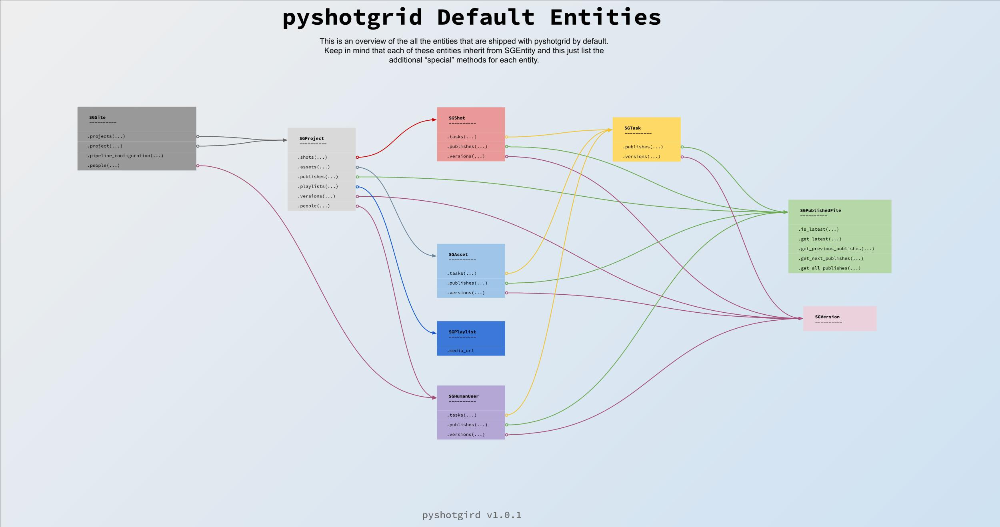

Overview of pyshotgrid's default entities
========================================

We ship a set of default entities that extend the functionality of some common entity types in
ShotGrid. Their implementation is rely on pyshotgrid's plugin system that you are free to use
, too. (Here is a guide to implement additional functionality to any ShotGrid entity.) This page
will give you a brief overview of the extra functionality and their connections between each other.

.. note::

  Each of the default entities inherit from SGEntity!

